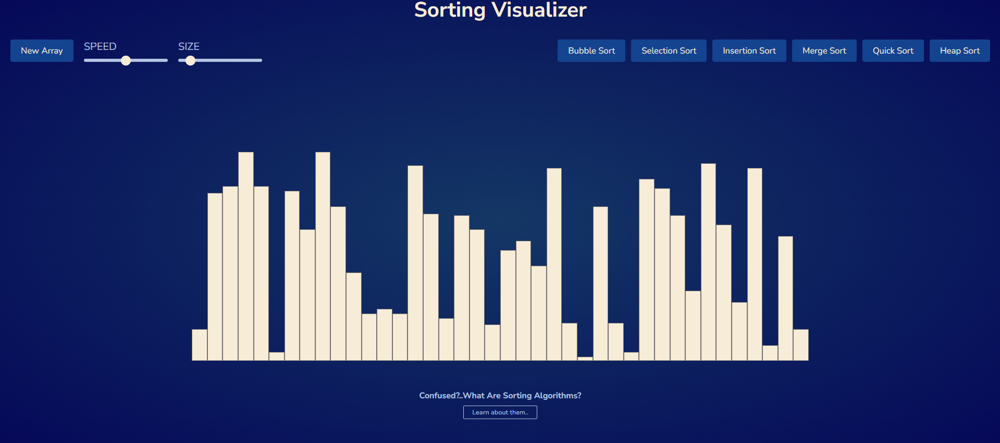

# Sorting Visualizer

This is a sorting visualizer implemented using HTML, CSS, and JavaScript.

## Description

The sorting visualizer allows you to visualize various sorting algorithms in action. You can select different sorting algorithms and adjust the array size and speed of visualization.

## Technologies Used

- HTML
- CSS
- JavaScript

## Features

- Visualization of various sorting algorithms.
- Adjustable array size.
- Adjustable speed of visualization.
- Selection of different sorting algorithms.

## Implementation

The visualizer consists of three main components:

1. **HTML Structure**: Defines the layout of the visualizer interface, including buttons, sliders, and canvas for visualization.

2. **CSS Styling**: Provides styling to make the interface visually appealing and user-friendly.

3. **JavaScript Logic**: Implements the sorting algorithms and handles user interactions to update the visualization accordingly.

## Sorting Algorithms Supported

The visualizer currently supports the following sorting algorithms:

- Bubble Sort
- Selection Sort
- Insertion Sort
- Merge Sort
- Quick Sort

## Live Demo

You can see the sorting visualizer in action by visiting the following link:

[Sorting Visualizer Demo](https://sorting-visualizer-smith.netlify.app/)

## Usage

To use the sorting visualizer:

1. Clone or download the repository.
2. Open the `index.html` file in a web browser.
3. Select a sorting algorithm from the list of buttons given.
4. Adjust the array size and visualization speed using the sliders.
5. Click any button of the sorting algorithms to start their respective visualization.
6. Watch as the sorting algorithm rearranges the elements of the array.

## Example

Below is a screenshot of the sorting visualizer interface:

## Credits

This project was created by [Soumyajoy Pal] as a demonstration of sorting algorithms and visualization techniques.
